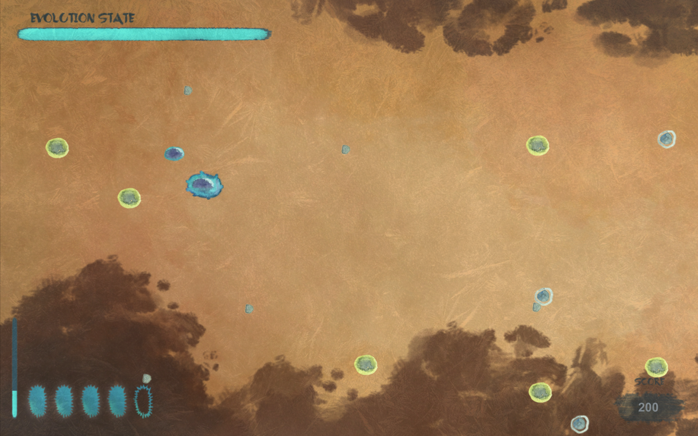
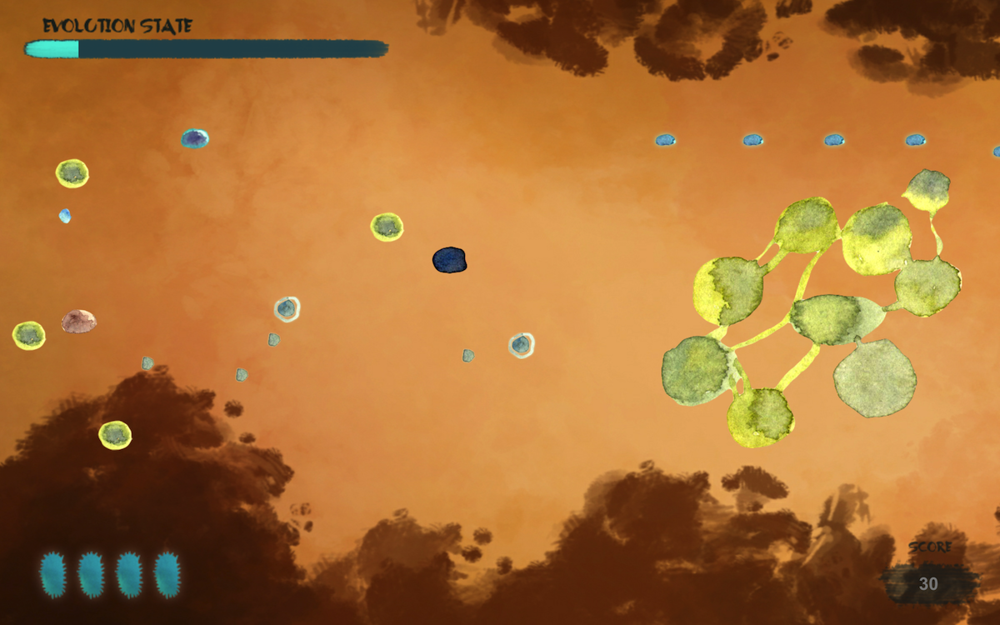

# Procaryota - 2D Cell Shooter

Procaryota is a small personal project developed under Unity with homemade graphics.
The game is still under development and you are welcome to report any bugs you catch!

## Development and releases

The game has been developed under Unity version 2018.3.11f1 and hasn't been tested on other versions but any version higher should do it.

Last Releases for Linux, MacOS and Windows

[Procaryota](https://github.com/WeiPhil/Procaryota/Builds/Windows.zip) (Windows x64)

[Procaryota](https://github.com/WeiPhil/Procaryota/Builds/MacOS.zip) (macOS)

[Procaryota](https://github.com/WeiPhil/Procaryota/Builds/Linux.zip) (Ubuntu x64)

## Screenshots

